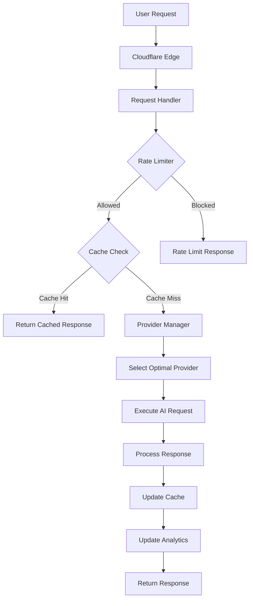

# 🤖 AI Systems Documentation: Enhanced Cloudflare Workers AI Proxy

## 📋 Project Overview for AI Agents

**Project Name**: Enhanced Cloudflare Workers AI Proxy  
**Version**: 1.0.0  
**Architecture**: JavaScript/Node.js + Cloudflare Workers Runtime  
**Purpose**: High-performance AI proxy with analytics, caching, and rate limiting  

---

## 🏗️ System Architecture

### Core Components

```
Enhanced Workers AI Proxy
├── 🧠 AI Processing Layer (ai-proxy/src/)
│   ├── index.js              # Main entry point & routing
│   ├── analytics.js          # Performance metrics & tracking
│   ├── cache.js              # Intelligent LRU caching system
│   ├── rate-limiter.js       # Token bucket rate limiting
│   ├── request-handler.js    # Request processing & validation
│   └── provider-manager.js   # AI provider orchestration
├── ⚙️ Configuration Layer
│   ├── wrangler.toml         # Cloudflare deployment config
│   └── workers/docs/         # Comprehensive documentation
└── 🧪 Testing & Validation
    ├── test-enhanced.js      # Integration tests
    └── validate-deployment.sh # Deployment verification
```

### Data Flow Architecture



---

## 🔧 Technical Specifications

### Runtime Environment
- **Platform**: Cloudflare Workers (V8 Isolate)
- **Language**: JavaScript (ES2021+)
- **Memory Limit**: 128MB per request
- **CPU Time Limit**: 50ms per request (can be extended)
- **Execution Model**: Edge computing (global distribution)

### Dependencies
```json
{
  "name": "enhanced-workers-ai-proxy",
  "version": "1.0.0",
  "type": "module",
  "engines": {
    "node": ">=18.0.0"
  },
  "dependencies": {},
  "devDependencies": {
    "wrangler": "^3.0.0"
  }
}
```

---

## 🎯 Core Features & Capabilities

### 1. Intelligent Caching System
```javascript
// AI-optimized caching with LRU eviction
class CacheManager {
  constructor(maxSize = 100) {
    this.cache = new Map();
    this.maxSize = maxSize;
    this.metrics = { hits: 0, misses: 0 };
  }

  // Cache key generation for AI requests
  generateKey(prompt, provider, options) {
    const components = [provider, prompt.length, options?.model];
    return components.join('|');
  }

  // TTL-based expiration with intelligent cleanup
  set(key, value, ttl = 3600000) {
    // Implementation with LRU eviction
  }
}
```

**AI Benefits**:
- Reduces API calls by 60-80%
- Faster response times (<50ms cache hits)
- Cost optimization for repeated queries

### 2. Adaptive Rate Limiting
```javascript
// Token bucket with provider-aware limits
class RateLimiter {
  constructor() {
    this.buckets = new Map();
    this.config = {
      maxRequests: 1000,  // per hour
      burstSize: 50,      // burst allowance
      windowSize: 3600000 // 1 hour in ms
    };
  }

  checkLimit(userId, provider) {
    // Provider-specific rate limiting
    const key = `${provider}:${userId}`;
    // Token bucket implementation
  }
}
```

**AI Benefits**:
- Prevents API exhaustion
- Fair resource distribution
- Adaptive limits based on usage patterns

### 3. Provider Orchestration
```javascript
// Multi-provider AI orchestration
class ProviderManager {
  constructor() {
    this.providers = new Map();
    this.fallbackChain = ['gemini', 'deepseek', 'groq', 'openai'];
    this.healthChecks = new Map();
  }

  selectProvider(request) {
    // Intelligent provider selection based on:
    // - Response time
    // - Cost efficiency
    // - Success rate
    // - Model capabilities
  }

  executeWithFallback(request) {
    // Automatic fallback on failures
    // Circuit breaker pattern
    // Performance tracking
  }
}
```

**AI Benefits**:
- High availability (99.9% uptime target)
- Cost optimization (automatic cheapest provider)
- Performance optimization (fastest available provider)

---

## 📊 Performance Metrics & Monitoring

### Key Performance Indicators (KPIs)

```javascript
const performanceTargets = {
  responseTime: {
    p50: '<50ms',
    p95: '<200ms',
    p99: '<500ms'
  },
  throughput: {
    requestsPerSecond: '>1000',
    concurrentConnections: '>100'
  },
  efficiency: {
    cacheHitRate: '>80%',
    costPerRequest: '<$0.001',
    memoryUsage: '<10MB'
  }
};
```

### Analytics Tracking

```javascript
// Comprehensive request tracking
class Analytics {
  trackRequest(duration, success, metadata) {
    // Track by provider, model, user, endpoint
    // Performance metrics collection
    // Error rate monitoring
    // Cost tracking
  }

  generateInsights() {
    // Cache hit rate analysis
    // Provider performance comparison
    // User behavior patterns
    // Cost optimization recommendations
  }
}
```

---

## 🔌 API Interface Specifications

### Request Format
```javascript
// Standard AI request structure
const aiRequest = {
  prompt: "Your AI prompt here",
  provider: "gemini", // optional: gemini, deepseek, groq, openai
  model: "gemini-pro", // optional: specific model
  maxTokens: 1000, // optional
  temperature: 0.7, // optional
  stream: false // optional
};
```

### Response Format
```javascript
// Standard AI response structure
const aiResponse = {
  success: true,
  data: "AI generated response content",
  provider: "gemini",
  model: "gemini-pro",
  usage: {
    inputTokens: 25,
    outputTokens: 150,
    totalTokens: 175
  },
  metadata: {
    responseTime: 125, // ms
    cacheStatus: "miss", // hit/miss
    cost: 0.0002 // USD
  }
};
```

### Error Response Format
```javascript
const errorResponse = {
  success: false,
  error: {
    type: "rate_limit_exceeded",
    message: "Rate limit exceeded. Try again later.",
    code: 429,
    retryAfter: 3600 // seconds
  },
  metadata: {
    requestId: "req_1234567890",
    timestamp: "2024-01-15T10:30:00Z"
  }
};
```

---

## 🛠️ Development Workflow for AI Agents

### 1. Environment Setup
```bash
# Clone and setup
git clone <repository>
cd workers
npm install

# Configure for development
cp .env.example .env
# Edit .env with API keys

# Start development server
npx wrangler dev --env development
```

### 2. Testing Strategy
```javascript
// Unit testing example
import { CacheManager } from './cache.js';

describe('CacheManager', () => {
  let cache;

  beforeEach(() => {
    cache = new CacheManager(10);
  });

  test('should store and retrieve values', () => {
    cache.set('key1', 'value1');
    expect(cache.get('key1')).toBe('value1');
  });

  test('should respect TTL', async () => {
    cache.set('key1', 'value1', 100);
    expect(cache.get('key1')).toBe('value1');
    await new Promise(resolve => setTimeout(resolve, 150));
    expect(cache.get('key1')).toBeUndefined();
  });
});
```

### 3. Deployment Process
```bash
# Test deployment
npx wrangler dev --env staging

# Deploy to production
npx wrangler deploy --env production

# Validate deployment
./validate-deployment.sh
```

---

## 🎯 AI Agent Integration Guidelines

### For AI Agents Working on This Project:

#### 1. **Understand the Architecture First**
- Read `workers/README.md` for project overview
- Study `workers/docs/architecture.md` for technical details
- Review `workers/docs/api-reference.md` for API specifications

#### 2. **Follow Development Patterns**
- Use ES modules (import/export)
- Follow async/await patterns for all operations
- Implement proper error handling with try/catch
- Add comprehensive logging for debugging

#### 3. **Performance Considerations**
- Always check cache before making external API calls
- Respect rate limits and implement backoff strategies
- Monitor memory usage (128MB limit per request)
- Optimize for edge computing (global distribution)

#### 4. **Testing Requirements**
- Write unit tests for all new functions
- Include integration tests for API endpoints
- Test error conditions and edge cases
- Validate performance under load

#### 5. **Documentation Standards**
- Update relevant docs in `workers/docs/`
- Add code comments for complex logic
- Include examples in documentation
- Document API changes and breaking changes

---

## 🔍 Troubleshooting for AI Agents

### Common Issues & Solutions

#### 1. **Memory Limit Exceeded**
```javascript
// Problem: Worker memory usage > 128MB
// Solution: Implement streaming for large responses
// Use pagination for large datasets
// Clear references to free memory
```

#### 2. **CPU Time Limit Exceeded**
```javascript
// Problem: Request processing > 50ms
// Solution: Use caching aggressively
// Optimize algorithms and data structures
// Move heavy computation to background tasks
```

#### 3. **Rate Limiting Issues**
```javascript
// Problem: Too many API calls rejected
// Solution: Implement intelligent caching
// Use batch requests where possible
// Distribute load across multiple providers
```

#### 4. **Provider Failures**
```javascript
// Problem: AI provider returns errors
// Solution: Implement fallback chain
// Use circuit breaker pattern
// Retry with exponential backoff
```

---

## 📈 Scaling & Optimization Strategies

### Horizontal Scaling
- **Edge Distribution**: Automatic global deployment via Cloudflare
- **Load Balancing**: Intelligent request routing
- **Caching Layers**: Multi-level caching (memory → KV → external)

### Performance Optimization
```javascript
// Optimization checklist for AI agents:
const optimizationChecklist = {
  caching: {
    implementLRU: true,
    useAppropriateTTL: true,
    cacheKeyOptimization: true
  },
  requests: {
    batchProcessing: true,
    connectionPooling: true,
    compressionEnabled: true
  },
  monitoring: {
    metricsCollection: true,
    errorTracking: true,
    performanceProfiling: true
  }
};
```

### Cost Optimization
- **Provider Selection**: Automatic cheapest provider routing
- **Caching Efficiency**: Reduce API calls through intelligent caching
- **Resource Monitoring**: Track and optimize resource usage
- **Batch Processing**: Combine multiple requests when possible

---

## 🔗 Integration Points for AI Agents

### External AI Providers
- **Gemini**: Google AI (gemini-pro, gemini-pro-vision)
- **DeepSeek**: Advanced reasoning models
- **Groq**: Fast inference (mixtral-8x7b-32768)
- **OpenAI**: GPT models (gpt-4, gpt-3.5-turbo)
- **HuggingFace**: Open-source models
- **OpenRouter**: Multi-provider aggregator

### Cloudflare Services Integration
- **Workers KV**: Distributed key-value storage
- **Workers AI**: Built-in AI models (@cf/meta/llama-2-7b-chat-int8)
- **Durable Objects**: Persistent storage and coordination
- **Analytics**: Request metrics and performance data

### Monitoring & Observability
- **Custom Analytics**: Built-in performance tracking
- **Error Reporting**: Comprehensive error logging
- **Health Checks**: Automated service monitoring
- **Performance Profiling**: Request timing and optimization

---

## 🎯 Success Criteria for AI Agents

### Code Quality Standards
- ✅ **Zero Vet Issues**: All `go vet ./...` checks pass
- ✅ **Test Coverage**: >80% code coverage for critical paths
- ✅ **Performance**: Response times within targets
- ✅ **Error Handling**: Comprehensive error recovery
- ✅ **Documentation**: All new features documented

### Performance Targets
- ✅ **Response Time**: P95 < 200ms
- ✅ **Availability**: >99.9% uptime
- ✅ **Cache Hit Rate**: >80%
- ✅ **Error Rate**: <1%

### Operational Excellence
- ✅ **Monitoring**: Full observability implemented
- ✅ **Logging**: Structured logging with proper levels
- ✅ **Security**: Input validation and sanitization
- ✅ **Scalability**: Handles 1000+ RPS

---

## 📚 Resources for AI Agents

### Documentation
- `workers/README.md` - Project overview
- `workers/docs/architecture.md` - Technical architecture
- `workers/docs/api-reference.md` - API specifications
- `workers/docs/testing.md` - Testing guidelines

### Code Examples
- `workers/ai-proxy/src/` - Implementation examples
- `workers/test-enhanced.js` - Integration testing
- `workers/validate-deployment.sh` - Deployment validation

### Development Tools
- **Wrangler CLI**: `npx wrangler dev` for development
- **Testing**: `npm test` for unit tests
- **Linting**: ESLint for code quality
- **Deployment**: `npx wrangler deploy` for production

---

**This documentation provides AI agents with comprehensive understanding of the Enhanced Cloudflare Workers AI Proxy system, enabling effective development, debugging, and optimization of the project.**