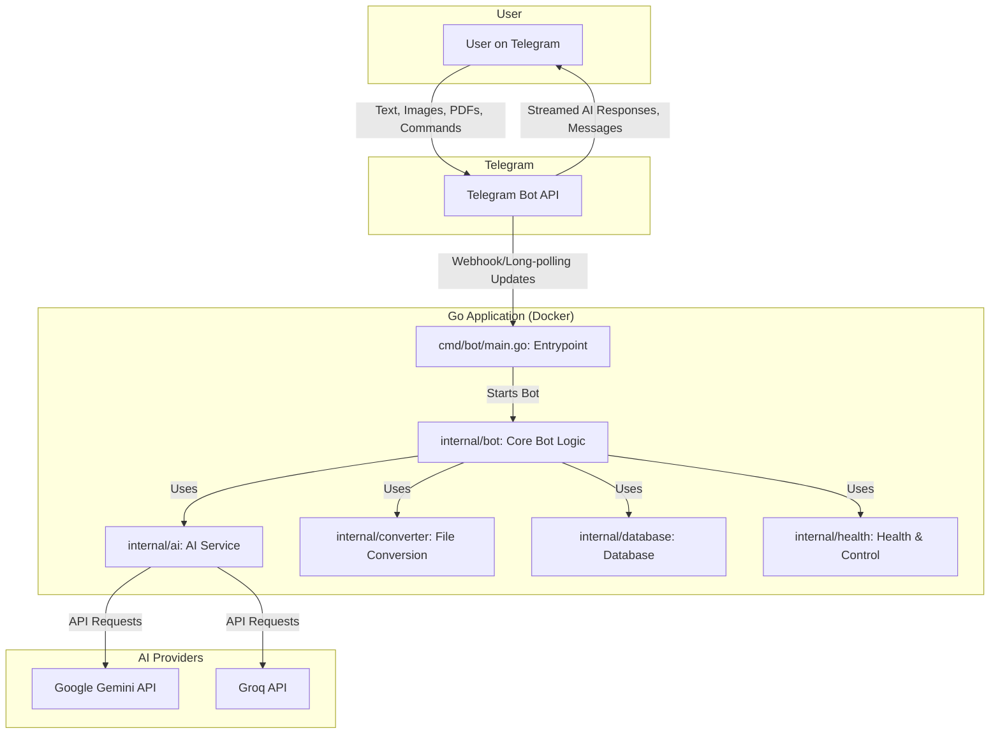

# GEMINI.md - Technical Documentation

This document provides a comprehensive technical overview of the AI-Powered Obsidian Automation Bot. It is intended for developers and contributors to the project.

## 1. Project Overview

The Obsidian Automation Bot is a Go-based Telegram bot designed to serve as a powerful, AI-enhanced assistant for note-taking and
knowledge management with Obsidian. The bot can process images and PDFs, extract text, and use Google's Gemini AI to summarize
content, answer questions, and generate structured data. It offers an interactive, conversational experience directly within
Telegram, including real-time streaming of AI responses.

The project is designed to be robust and resilient, featuring automatic API key rotation for the Gemini service and a flexible
configuration system. It is fully containerized with Docker for easy deployment and management.

## 2. Core Features

### AI & Content Processing

-   **AI-Powered Analysis**: Leverages Google's Gemini models (`gemini-flash` and `gemini-pro`) and **Groq** for content summarization, question answering, and categorization.
-   **Multi-Provider AI Support**: Seamlessly switch between Google Gemini and Groq AI providers, offering flexibility and optimized performance.
-   **Streaming Responses**: AI-generated responses are streamed in real-time to the user for an interactive, "live-typing" experience.
-   **Multi-Language Support**: AI responses can be configured to default to any language on-the-fly via
    the `/lang` command. This flexibility is enabled by the underlying AI models' multilingual capabilities.
-   **Question Answering**: The AI is prompted to answer any questions it finds within the text of a provided document.
-   **OCR & Text Extraction**: Uses Tesseract for OCR on images and `pdftotext` for extracting content from PDF files.
-   **Improved PDF Conversion**: Utilizes a headless Chrome instance to convert Markdown notes to PDF, ensuring high-fidelity rendering of complex notes, including those with LaTeX.
-   **Reliable AI Interaction**: Implements a two-call AI strategy. The first call obtains a human-readable summary, streamed
    in real-time. The second, separate call, is used to extract structured JSON data (e.g., category, topics). This separation
    significantly reduces the risk of JSON parsing errors, as the AI can focus on generating valid JSON without interference
    from streaming or conversational elements.

### Bot & User Interaction

-   **Chatbot Mode**: Functions as a general-purpose chatbot, treating any non-command text message as a prompt for the AI.
-   **Interactive Commands**: A rich set of slash commands for managing the bot and accessing features, including `/setprovider` to switch AI models, `/last` to show the last note created, `/reprocess` to reprocess the last sent file, and `/pid` to get the process ID of the bot.
-   **Command Autocompletion**: Registers its command list with Telegram, providing users with an easy-to-use command menu.
-   **"Typing" Indicator**: Provides real-time user feedback by displaying the "typing..." status while processing requests.

### Robustness & Configuration

-   **Multi-API Key Support**: Manages a list of Gemini API keys from a single environment variable (`GEMINI_API_KEYS`).
-   **Automatic Key Rotation**: Automatically detects `429` quota errors from the Gemini API and switches to the next available
    key, ensuring high availability.
-   **Manual Key Switching**: Allows manual rotation of API keys via the `/switchkey` command.
-   **Resilient Initialization**: The AI service can be disabled without crashing the bot if no API keys are provided.

## 3. Architecture

The bot's architecture is centered around a main Go application running inside a Docker container.



_Note: This Mermaid diagram replaces the previous text-based version for better clarity and maintainability._

## 4. Configuration

The application is configured via a `.env` file in the project root.

-   `TELEGRAM_BOT_TOKEN` (Required): Your token from Telegram's BotFather.
-   `GEMINI_API_KEYS` (Required): A **comma-separated list** of your Gemini API keys. Do not include spaces between the keys.
    The bot will use these keys and rotate them automatically upon hitting quota limits.
-   `GROQ_API_KEY` (Required for Groq provider): Your Groq API key.
-   `OLLAMA_HOST` (Optional): The host for a local Ollama instance. *Note: The fallback to Ollama is not yet implemented.*

**Example `.env` file:**
```dotenv
TELEGRAM_BOT_TOKEN=12345:your-long-telegram-token
GEMINI_API_KEYS=key-one,key-two,key-three
GROQ_API_KEY=your-groq-api-key
OLLAMA_HOST=http://localhost:11434
```

## 5. Development Guide

The project uses a `Makefile` to simplify common development tasks.

-   **`make up`**: Builds the Docker image and starts the container. This is the main command to get the bot running.
-   **`make down`**: Stops and removes the Docker container.
-   **`make logs`**: Tails the live logs from the running container.
-   **`make build`**: Forces a rebuild of the Docker image.
-   **`make help`**: Shows a list of all available `make` commands.

### Documentation Standards

To maintain high quality and consistency, `GEMINI.md` and other Markdown documentation files in this project are subject
to linting using `markdownlint`. A configuration file (`.markdownlint.json`) in the project root defines the specific
rules and styles enforced. It is recommended to run `markdownlint` locally before committing changes, and it is integrated
into the project's CI/CD pipeline to ensure adherence to standards.

## 6. Codebase Deep Dive

### `cmd/bot/main.go`

-   **`main()`**: The main entrypoint of the application. It initializes the PID lock, handles signals for graceful shutdown, and starts the bot.

### `internal/bot`

-   This package contains the core bot logic.
-   **`main.go`**: Contains the main `Run` function that initializes the bot, sets up command handlers, and enters the main update loop.
-   **`handler.go`**: (Assuming this file exists) Contains the `handleCommand`, `handlePhoto`, and `handleDocument` functions.
-   **`processor.go`**: Contains the `processFileWithAI` function, which orchestrates text extraction, AI processing, and note creation.
-   **`dedup.go`**: Contains the `IsDuplicate` function for checking for duplicate files.
-   **`stats.go`**: Contains the logic for tracking usage statistics.

### `internal/ai`

-   **`ai_service.go`**: Contains the `AIService` struct, which manages multiple AI providers.
-   **`provider.go`**: Defines the `AIProvider` interface.
-   **`gemini_provider.go`**: Implements the `AIProvider` interface for the Google Gemini API.
-   **`groq_provider.go`**: Implements the `AIProvider` interface for the Groq API.
-   **`mock_provider.go`**: Implements mock providers for testing.

### `internal/converter`

-   **`converter.go`**: Contains the `ConvertMarkdownToPDF` function for converting Markdown to PDF using pandoc and tectonic.

### `internal/database`

-   **`db.go`**: Contains the database initialization logic.
-   **`schema.go`**: Contains the database schema.

### `internal/health`

-   **`health.go`**: Contains the health and control endpoints: `/status`, `/pause`, and `/resume`.

### `internal/pid`

-   **`pid.go`**: Contains the PID lock mechanism to ensure only one instance of the bot is running.

## 7. Future Improvements

This section outlines potential enhancements and new features for the bot. For a detailed list of specific tasks and their
current status, please refer to the `TODO.md` file.

Key areas for future development include:
-   **Local AI Fallback**: Completing the integration with Ollama for local AI processing.
-   **User Customization**: Implementing per-user settings for features like language preferences.
-   **More Advanced Commands**: Adding functionality like `/search` or `/config` commands.
-   **Observability**: Adding a web dashboard for monitoring bot statistics and health.
-   **Broader File Type Support**: Expanding the range of document types the bot can process (e.g., .docx, .txt).

## 8. Bot Instance Management

### PID File Lock
The bot implements a PID (Process ID) file lock mechanism to prevent multiple instances from running simultaneously, which would cause Telegram API conflicts.

**How it works:**
1. On startup, the bot creates a `bot.pid` file containing its process ID
2. If the file already exists, the bot checks if that process is still running
3. If another instance is active, the new instance exits gracefully
4. On shutdown, the PID file is automatically removed

**Files:**
- PID file location: `./bot.pid` (project root)
- Signal handling: SIGINT, SIGTERM for graceful shutdown

This prevents the "Conflict: terminated by other getUpdates request" error during deployments or when accidentally starting multiple instances.

### Observability

The bot provides several endpoints for monitoring and control:

-   `/status`: Returns a JSON object with the current status of the bot, including PID, uptime, Go version, OS, architecture, and last activity time. The same information is also available in the response headers.
-   `/pause`: Pauses the bot's listening activity. The bot will stop processing new updates from Telegram.
-   `/resume`: Resumes the bot's listening activity.