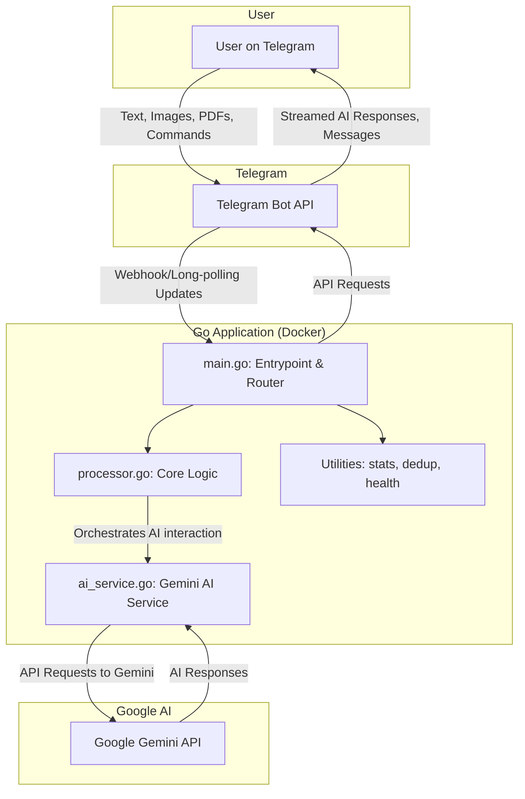

# GEMINI.md - Technical Documentation

This document provides a comprehensive technical overview of the AI-Powered Obsidian Automation Bot. It is intended for developers and contributors to the project.

## 1. Project Overview

The Obsidian Automation Bot is a Go-based Telegram bot designed to serve as a powerful, AI-enhanced assistant for note-taking and
knowledge management with Obsidian. The bot can process images and PDFs, extract text, and use Google's Gemini AI to summarize
content, answer questions, and generate structured data. It offers an interactive, conversational experience directly within
Telegram, including real-time streaming of AI responses.

The project is designed to be robust and resilient, featuring automatic API key rotation for the Gemini service and a flexible
configuration system. It is fully containerized with Docker for easy deployment and management.

## 2. Core Features

### AI & Content Processing

-   **AI-Powered Analysis**: Leverages Google's Gemini models (`gemini-flash` and `gemini-pro`) for content summarization,
    question answering, and categorization.
-   **Streaming Responses**: AI-generated responses are streamed in real-time to the user for an interactive, "live-typing" experience.
-   **Multi-Language Support**: AI responses can be configured to default to any language on-the-fly via
    the `/lang` command. This flexibility is enabled by the underlying Gemini models' multilingual capabilities.
-   **Question Answering**: The AI is prompted to answer any questions it finds within the text of a provided document.
-   **OCR & Text Extraction**: Uses Tesseract for OCR on images and `pdftotext` for extracting content from PDF files.
-   **Reliable AI Interaction**: Implements a two-call AI strategy. The first call obtains a human-readable summary, streamed
    in real-time. The second, separate call, is used to extract structured JSON data (e.g., category, topics). This separation
    significantly reduces the risk of JSON parsing errors, as the AI can focus on generating valid JSON without interference
    from streaming or conversational elements.

### Bot & User Interaction

-   **Chatbot Mode**: Functions as a general-purpose chatbot, treating any non-command text message as a prompt for the AI.
-   **Interactive Commands**: A rich set of slash commands for managing the bot and accessing features.
-   **Command Autocompletion**: Registers its command list with Telegram, providing users with an easy-to-use command menu.
-   **"Typing" Indicator**: Provides real-time user feedback by displaying the "typing..." status while processing requests.

### Robustness & Configuration

-   **Multi-API Key Support**: Manages a list of Gemini API keys from a single environment variable (`GEMINI_API_KEYS`).
-   **Automatic Key Rotation**: Automatically detects `429` quota errors from the Gemini API and switches to the next available
    key, ensuring high availability.
-   **Manual Key Switching**: Allows manual rotation of API keys via the `/switchkey` command.
-   **Resilient Initialization**: The AI service can be disabled without crashing the bot if no API keys are provided.

## 3. Architecture

The bot's architecture is centered around a main Go application running inside a Docker container.



_Note: This Mermaid diagram replaces the previous text-based version for better clarity and maintainability._

## 4. Configuration

The application is configured via a `.env` file in the project root.

-   `TELEGRAM_BOT_TOKEN` (Required): Your token from Telegram's BotFather.
-   `GEMINI_API_KEYS` (Required): A **comma-separated list** of your Gemini API keys. Do not include spaces between the keys.
    The bot will use these keys and rotate them automatically upon hitting quota limits.
-   `OLLAMA_HOST` (Optional): The host for a local Ollama instance. *Note: The fallback to Ollama is not yet implemented.*

**Example `.env` file:**
```dotenv
TELEGRAM_BOT_TOKEN=12345:your-long-telegram-token
GEMINI_API_KEYS=key-one,key-two,key-three
OLLAMA_HOST=http://localhost:11434
```

## 5. Development Guide

The project uses a `Makefile` to simplify common development tasks.

-   **`make up`**: Builds the Docker image and starts the container. This is the main command to get the bot running.
-   **`make down`**: Stops and removes the Docker container.
-   **`make logs`**: Tails the live logs from the running container.
-   **`make build`**: Forces a rebuild of the Docker image.
-   **`make help`**: Shows a list of all available `make` commands.

### Documentation Standards

To maintain high quality and consistency, `GEMINI.md` and other Markdown documentation files in this project are subject
to linting using `markdownlint`. A configuration file (`.markdownlint.json`) in the project root defines the specific
rules and styles enforced. It is recommended to run `markdownlint` locally before committing changes, and it is integrated
into the project's CI/CD pipeline to ensure adherence to standards.

## 6. Codebase Deep Dive

### `main.go`

-   **`main()`**: Initializes services (AI, Bot API), sets up the command autocompletion menu with Telegram, and starts the
    main update loop.
-   **Update Loop**: Handles incoming messages concurrently using goroutines for better responsiveness.
-   **`handleCommand()`**: A sophisticated command router that handles both slash commands (e.g., `/stats`) and general text
    messages (chatbot mode).
-   **`handlePhoto()` / `handleDocument()`**: These functions manage the file download and processing workflow. They are
    responsible for sending the initial "Processing..." message and initiating the streaming process.
-   **`createObsidianNote()`**: Orchestrates the entire note creation process, including defining the streaming callback function,
    calling the AI processor, and saving the final `.md` file.

### `processor.go`

-   **`processFileWithAI()`**: This is the core orchestration function. It takes the file path, AI service, and a streaming
    callback as input.
    1.  Extracts text from the file.
    2.  Makes the **first AI call** (`GenerateContent`) to get a human-readable summary, streaming the response back via the callback.
    3.  Makes the **second AI call** (`GenerateJSONData`) to get structured data (category, topics, etc.) in a reliable way.
    4.  Parses the JSON and combines all the information into the `ProcessedContent` struct.
-   **`extractTextFrom...()`**: Helper functions that use external tools (`tesseract`, `pdftotext`) to get text from files.
-   **`classifyContent()`**: A simple, non-AI-based classifier used as a fallback if the AI service fails.

### `ai_service.go`

-   **`AIService` struct**: Holds the list of `genai.Client` instances and tracks the `currentKeyIndex`.
-   **`NewAIService()`**: Reads the `GEMINI_API_KEYS` from the environment, splits them, and creates a client for each valid key.
-   **`GenerateContent()` / `GenerateJSONData()`**: These functions contain the core retry logic. They loop through the available
    clients, making the API call. If they receive a `429` error, they call `switchToNextKey()` and retry the request with
    the next client. This provides seamless, automatic failover between API keys.
-   **`SwitchKey()`**: A public method to allow manual triggering of the key rotation via the `/switchkey` command.

## 7. Future Improvements

This section outlines potential enhancements and new features for the bot. For a detailed list of specific tasks and their
current status, please refer to the `TODO.md` file.

Key areas for future development include:
-   **Local AI Fallback**: Completing the integration with Ollama for local AI processing.
-   **User Customization**: Implementing per-user settings for features like language preferences.
-   **More Advanced Commands**: Adding functionality like `/search` or `/config` commands.
-   **Observability**: Adding a web dashboard for monitoring bot statistics and health.
-   **Broader File Type Support**: Expanding the range of document types the bot can process (e.g., .docx, .txt).
