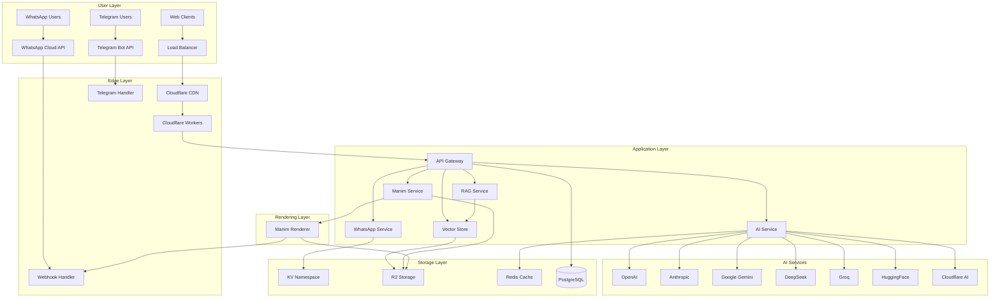
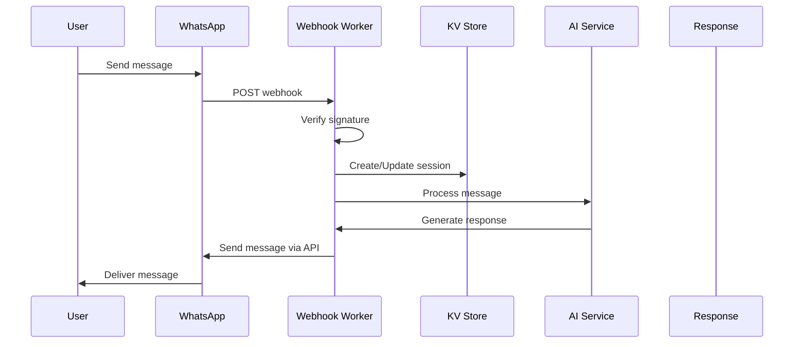
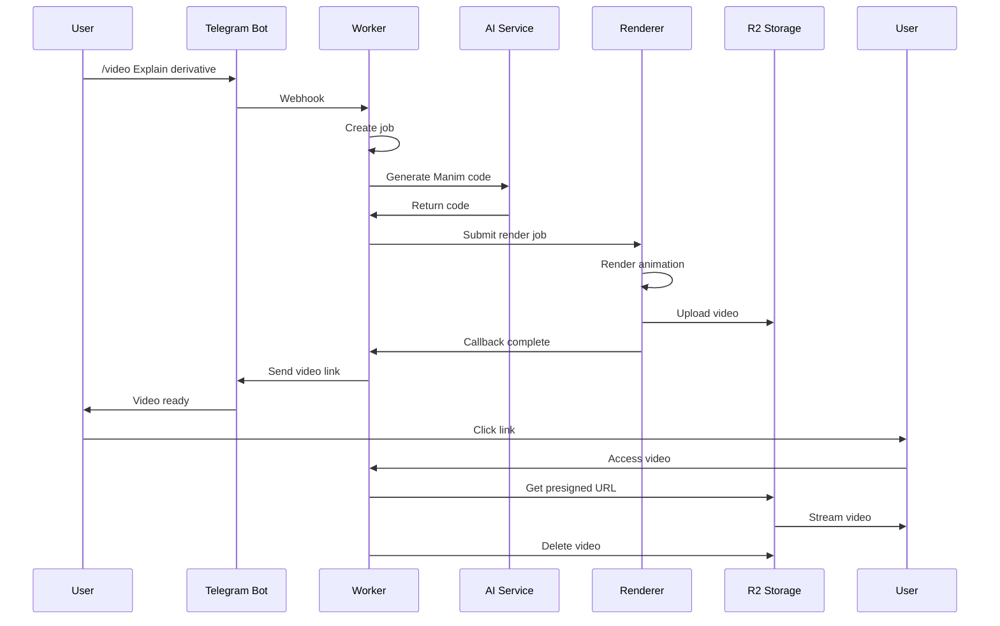
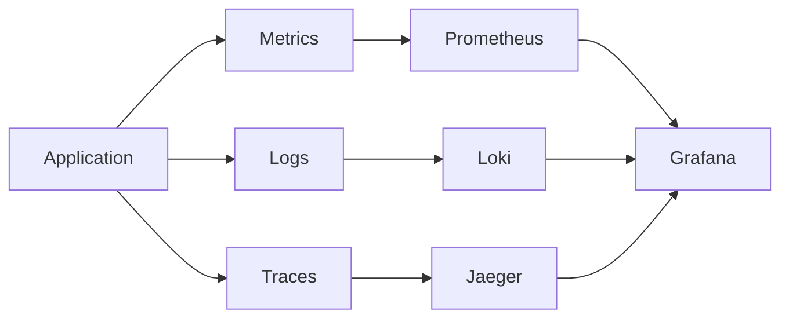

# Architecture Documentation

This document describes the high-level architecture of the Obsidian Vault system.

## System Overview

Obsidian Vault is a multi-service platform providing:
- WhatsApp Business API integration
- AI-powered automation and chat
- Mathematical visualization generation (Manim)
- Knowledge base and RAG capabilities
- Real-time processing with Cloudflare Workers

## Architecture Diagram



---

## Component Architecture

### 1. Cloudflare Workers (Edge Computing)

**Purpose**: Handle incoming requests at the edge for low latency

**Workers**
- `ai-manim-worker`: Main worker for AI video generation
- `worker-whatsapp`: WhatsApp webhook processing
- `worker-ai`: General AI request handling

**Characteristics**
- Serverless execution
- Global distribution
- Automatic scaling
- 10ms cold start typical

**Configuration**
```toml
name = "ai-manim-worker"
main = "src/index.ts"
compatibility_date = "2024-09-23"
compatibility_flags = ["nodejs_compat"]

[vars]
LOG_LEVEL = "info"

[[kv_namespaces]]
binding = "SESSIONS"
id = "your-kv-id"
```

---

### 2. API Gateway

**Purpose**: Central entry point for all API requests

**Responsibilities**
- Request routing
- Authentication
- Rate limiting
- Request validation
- Response formatting

**Flow**
```
Client Request
    ↓
Authentication Check
    ↓
Rate Limit Check
    ↓
Route to Service
    ↓
Process Request
    ↓
Format Response
    ↓
Return to Client
```

---

### 3. Services Architecture

#### WhatsApp Service

```
┌─────────────────┐
│  Webhook Handler│
└────────┬────────┘
         ↓
┌─────────────────┐
│  Message Parser │
└────────┬────────┘
         ↓
┌─────────────────┐
│  Pipeline       │────→ AI Processing
│  Orchestrator   │
└────────┬────────┘
         ↓
┌─────────────────┐
│  Response       │
│  Sender         │
└─────────────────┘
```

**Key Components**
- Webhook verification
- Message parsing (text, media, buttons)
- Session management
- Template message handling

#### AI Service

```
┌─────────────────┐
│  Request Router │
└────────┬────────┘
         ↓
┌─────────────────┐
│  Provider       │
│  Selector       │
└────────┬────────┘
         ↓
┌─────────────────┐
│  Fallback Chain │
│  ├─ OpenAI      │
│  ├─ Anthropic   │
│  └─ ...         │
└────────┬────────┘
         ↓
┌─────────────────┐
│  Response       │
│  Validator      │
└─────────────────┘
```

**Features**
- Automatic provider fallback
- Cost tracking per user
- Request caching
- Token usage monitoring

#### Manim Service

```
┌─────────────────┐
│  Problem Input  │
└────────┬────────┘
         ↓
┌─────────────────┐
│  AI Code Gen    │
└────────┬────────┘
         ↓
┌─────────────────┐
│  Code Validator │
└────────┬────────┘
         ↓
┌─────────────────┐
│  Renderer       │
│  (Docker/Cloud) │
└────────┬────────┘
         ↓
┌─────────────────┐
│  R2 Upload      │
└────────┬────────┘
         ↓
┌─────────────────┐
│  Presigned URL  │
│  Generation     │
└─────────────────┘
```

---

## Data Flow Diagrams

### WhatsApp Message Flow



### Manim Video Generation Flow



---

## Storage Architecture

### Cloudflare KV

**Purpose**: Session storage and job state management

**Structure**
```
sessions:{session_id} → JSON (UserSession)
jobs:{job_id} → JSON (ProcessingJob)
sessions:by_chat:{chat_id} → session_id (index)
```

**TTL Strategy**
- Active sessions: 7 days
- Queued jobs: 24 hours
- Processing jobs: 1 hour
- Ready videos: 5 minutes
- Failed jobs: 1 hour

### Cloudflare R2

**Purpose**: Media storage (videos, images, documents)

**Structure**
```
videos/{job_id}.mp4
images/{media_id}
documents/{doc_id}
```

**Lifecycle**
- Videos: Auto-delete after 24 hours
- Images: Auto-delete after 7 days
- Documents: Auto-delete after 30 days

### Vector Store (Memory/SQLite)

**Purpose**: RAG document embeddings

**Schema**
```sql
CREATE TABLE vector_documents (
    id TEXT PRIMARY KEY,
    content TEXT NOT NULL,
    metadata TEXT,
    vector TEXT NOT NULL,
    created_at DATETIME DEFAULT CURRENT_TIMESTAMP
);

CREATE INDEX idx_content ON vector_documents(content);
```

---

## Security Architecture

### Authentication Layers

```
┌─────────────────────────────────┐
│  Layer 1: Edge Security         │
│  - WAF rules                    │
│  - DDoS protection              │
│  - Bot detection                │
└─────────────────────────────────┘
         ↓
┌─────────────────────────────────┐
│  Layer 2: API Authentication    │
│  - Bearer token validation      │
│  - API key verification         │
│  - JWT verification             │
└─────────────────────────────────┘
         ↓
┌─────────────────────────────────┐
│  Layer 3: Service Authorization │
│  - RBAC permissions             │
│  - Resource ownership           │
│  - Rate limits per user         │
└─────────────────────────────────┘
```

### Secrets Management

**Strategy**: Doppler + Environment Variables

```
┌──────────────┐     ┌──────────────┐     ┌──────────────┐
│  Doppler     │────▶│  Environment │────▶│  Application│
│  Dashboard   │     │  Variables   │     │  Code        │
└──────────────┘     └──────────────┘     └──────────────┘
```

**Secrets Categories**
- API Keys (external services)
- Database credentials
- Encryption keys
- JWT secrets

---

## Scaling Strategy

### Horizontal Scaling

**Cloudflare Workers**
- Automatic scaling per request
- No configuration needed
- Global distribution

**Stateless Services**
- All state in KV/R2/database
- No sticky sessions
- Load balanced globally

### Vertical Scaling

**Database**
- Connection pooling
- Read replicas for queries
- Connection limits per service

**AI Services**
- Request queuing
- Provider load balancing
- Cache expensive operations

---

## Monitoring Architecture

### Metrics Collection



### Key Metrics

**Application Metrics**
- Request latency (p50, p95, p99)
- Request rate
- Error rate
- Active sessions

**Business Metrics**
- AI token usage
- Video renders per day
- Message throughput
- Cost per user

**Infrastructure Metrics**
- KV operation latency
- R2 upload/download speed
- AI provider response times
- Cache hit rate

---

## Deployment Architecture

### Environments

```
┌─────────────────────────────────────────────────────────┐
│  Development                                           │
│  - Local machine                                       │
│  - Local databases                                     │
│  - Debug logging enabled                               │
└─────────────────────────────────────────────────────────┘
                         ↓
┌─────────────────────────────────────────────────────────┐
│  Staging                                               │
│  - Cloudflare preview deployments                      │
│  - Staging data stores                                 │
│  - Full feature parity                                 │
└─────────────────────────────────────────────────────────┘
                         ↓
┌─────────────────────────────────────────────────────────┐
│  Production                                            │
│  - Live Cloudflare workers                             │
│  - Production data stores                              │
│  - Optimized performance                               │
└─────────────────────────────────────────────────────────┘
```

### CI/CD Pipeline

```
Git Push
    ↓
GitHub Actions
    ├─ Lint & Type Check
    ├─ Unit Tests
    ├─ Build Workers
    └─ Integration Tests
            ↓
Deploy Preview (Staging)
    ↓
Manual Approval
    ↓
Deploy to Production
```

---

## Cost Architecture

### Cost Breakdown

| Component | Cost Factor | Estimated Monthly |
|-----------|-------------|-------------------|
| Cloudflare Workers | Requests × Compute | $50-200 |
| Cloudflare R2 | Storage + Egress | $20-100 |
| Cloudflare KV | Reads/Writes | $10-50 |
| AI Providers | Token usage | $100-500 |
| Database | Compute + Storage | $50-200 |

### Cost Optimization Strategies

1. **Caching**
   - Cache AI responses
   - Cache RAG queries
   - CDN caching for static assets

2. **Request Batching**
   - Batch RAG queries
   - Combine database operations

3. **Provider Selection**
   - Use cheaper providers for simple tasks
   - Implement fallback to cost-effective options

4. **Resource Limits**
   - Maximum video length
   - Maximum prompt size
   - Rate limits per user
