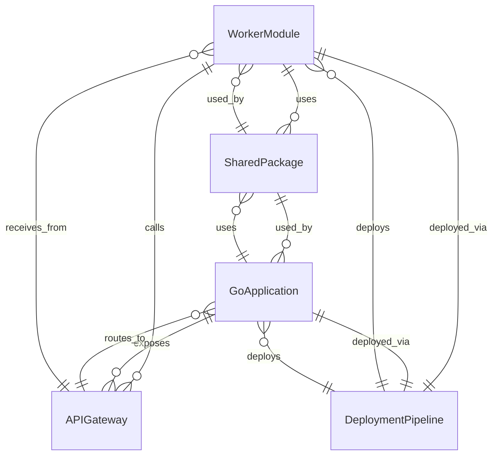

# Data Model: Architectural Separation

**Feature**: Architectural Separation for Workers and Go Applications  
**Date**: January 15, 2025  
**Status**: Draft

## Entity Overview

Based on the feature specification, the following entities form the core of the architectural separation:

### Primary Entities

1. **WorkerModule** - Independent JavaScript worker units
2. **GoApplication** - Backend Go services
3. **SharedPackage** - Common functionality and contracts
4. **APIGateway** - Communication layer between components
5. **DeploymentPipeline** - Independent deployment configurations

## Entity Definitions

### 1. WorkerModule

**Description**: Independent JavaScript/Cloudflare Worker unit with specific functionality.

**Fields**:
```typescript
interface WorkerModule {
  id: string                    // Unique identifier
  name: string                 // Human-readable name
  version: string              // Semantic version (v1.0.0)
  description: string          // Purpose and functionality
  entryPoint: string           // Main file path (src/index.ts)
  dependencies: string[]       // npm package dependencies
  environment: Record<string, string>  // Environment variables
  routes: RouteMapping[]       // URL route mappings
  permissions: string[]        // Cloudflare Workers permissions
  resources: ResourceLimits    // CPU/memory limits
}
```

**Relationships**:
- Uses → SharedPackage (many-to-many)
- Calls → GoApplication (many-to-many via APIGateway)
- DeployedVia → DeploymentPipeline (one-to-one)

**Validation Rules**:
- `name` must be unique across all workers
- `version` must follow semantic versioning
- `entryPoint` must exist in worker directory
- `routes` must not conflict with other workers

---

### 2. GoApplication

**Description**: Backend Go service with specific business domain.

**Fields**:
```go
type GoApplication struct {
    ID          string                 `json:"id"`
    Name        string                 `json:"name"`
    Version     string                 `json:"version"`
    Description string                 `json:"description"`
    ModulePath  string                 `json:"modulePath"`  // Go module path
    EntryPoint  string                 `json:"entryPoint"` // cmd/main.go
    Port        int                    `json:"port"`       // Service port
    Database    DatabaseConfig         `json:"database"`
    APIs        []APIEndpoint          `json:"apis"`
    Dependencies []GoDependency        `json:"dependencies"`
    Resources   ResourceLimits         `json:"resources"`
}

type DatabaseConfig struct {
    Type     string `json:"type"`     // postgres, mysql, etc.
    Host     string `json:"host"`
    Port     int    `json:"port"`
    Name     string `json:"name"`
    Migrations string `json:"migrations"` // Migration path
}
```

**Relationships**:
- Uses → SharedPackage (many-to-many)
- Exposes → APIEndpoint (one-to-many)
- DeployedVia → DeploymentPipeline (one-to-one)

**Validation Rules**:
- `Name` must be unique across all Go applications
- `Port` must be unique within the same environment
- `ModulePath` must be valid Go module path
- `Database` configuration must be valid for database type

---

### 3. SharedPackage

**Description**: Common functionality shared across workers and Go applications.

**Fields**:
```typescript
interface SharedPackage {
  id: string                    // Unique identifier
  name: string                 // Package name
  version: string              // Semantic version
  type: 'types' | 'contracts' | 'communication' | 'utilities'
  languages: string[]          // Supported languages (go, typescript)
  goModule?: GoPackageConfig   // Go-specific configuration
  npmPackage?: NpmPackageConfig // npm-specific configuration
  dependencies: string[]       // Package dependencies
  exports: string[]            // Public exports
}
```

**Go Package Config**:
```go
type GoPackageConfig struct {
    ModulePath string   `json:"modulePath"`
    GoVersion  string   `json:"goVersion"`
    Imports    []string `json:"imports"`
}
```

**NPM Package Config**:
```typescript
interface NpmPackageConfig {
  packageName: string
  main: string
  types: string
  scripts: Record<string, string>
}
```

**Relationships**:
- UsedBy → WorkerModule (many-to-many)
- UsedBy → GoApplication (many-to-many)

**Validation Rules**:
- `name` must be unique across shared packages
- `version` must follow semantic versioning
- At least one language must be supported
- `exports` must exist in package files

---

### 4. APIGateway

**Description**: Communication layer and routing between workers and Go applications.

**Fields**:
```go
type APIGateway struct {
    ID           string              `json:"id"`
    Name         string              `json:"name"`
    Version      string              `json:"version"`
    Routes       []Route             `json:"routes"`
    Middlewares  []Middleware        `json:"middlewares"`
    RateLimit    RateLimitConfig     `json:"rateLimit"`
    CORS         CORSConfig          `json:"cors"`
    Auth         AuthConfig          `json:"auth"`
}

type Route struct {
    Method      string            `json:"method"`      // GET, POST, etc.
    Path        string            `json:"path"`        // /api/v1/users
    Target      string            `json:"target"`      // go-service:8080
    Timeout     time.Duration     `json:"timeout"`
    Retry       RetryConfig       `json:"retry"`
}
```

**Relationships**:
- RoutesTo → GoApplication (one-to-many)
- ReceivesFrom → WorkerModule (one-to-many)

**Validation Rules**:
- `Path` patterns must not conflict
- `Target` must reference valid Go application
- `Method` must be valid HTTP method

---

### 5. DeploymentPipeline

**Description**: Independent deployment configuration for each component.

**Fields**:
```typescript
interface DeploymentPipeline {
  id: string                    // Unique identifier
  name: string                 // Pipeline name
  componentId: string          // WorkerModule or GoApplication ID
  componentType: 'worker' | 'go-app'
  triggers: TriggerConfig[]     // Deployment triggers
  stages: PipelineStage[]       // Deployment stages
  environment: EnvironmentConfig // Target environment
  notifications: NotificationConfig[] // Status notifications
}
```

**Pipeline Stage**:
```typescript
interface PipelineStage {
  name: string
  type: 'build' | 'test' | 'deploy' | 'verify'
  commands: string[]
  timeout: number
  onFailure: 'continue' | 'stop' | 'rollback'
}
```

**Relationships**:
- Deploys → WorkerModule (one-to-one)
- Deploys → GoApplication (one-to-one)

**Validation Rules**:
- `componentId` must reference valid component
- `stages` must include build, test, and deploy
- `environment` must be valid deployment target

## Entity Relationships



## State Transitions

### WorkerModule States
1. **Development** → **Testing** → **Staging** → **Production**
2. **Production** → **Rollback** (to previous version)
3. **Any State** → **Archived** (when deprecated)

### GoApplication States
1. **Development** → **Testing** → **Staging** → **Production**
2. **Production** → **Maintenance** (read-only mode)
3. **Any State** → **Decommissioned** (when removed)

### SharedPackage States
1. **Draft** → **Published** → **Deprecated** → **Archived**
2. **Published** → **Updated** (new version)

## Data Validation Rules

### Cross-Entity Validation
1. **Unique Names**: WorkerModule names and GoApplication names must be unique across their respective types
2. **Version Compatibility**: Shared package versions must be compatible with consuming components
3. **API Contract Compliance**: Workers must use valid API endpoints exposed by Go applications
4. **Resource Limits**: Component resource allocations must not exceed infrastructure capacity

### Business Rules
1. **Deployment Independence**: Each component must be deployable without affecting others
2. **Communication Boundaries**: Workers can only communicate with Go applications via APIGateway
3. **Shared Package Usage**: Components must use shared packages for common functionality
4. **Version Management**: All components must follow semantic versioning

## Performance Considerations

### Indexing Strategy
- **WorkerModule.id**: Primary key for worker lookups
- **GoApplication.id**: Primary key for application lookups
- **SharedPackage.name**: Unique constraint for package management
- **APIGateway.routes.path**: Indexed for route resolution

### Caching Strategy
- **APIGateway routes**: Cache for 5 minutes
- **SharedPackage metadata**: Cache for 1 hour
- **DeploymentPipeline status**: Real-time (no caching)

---

**Data model complete. Ready for API contract generation.**