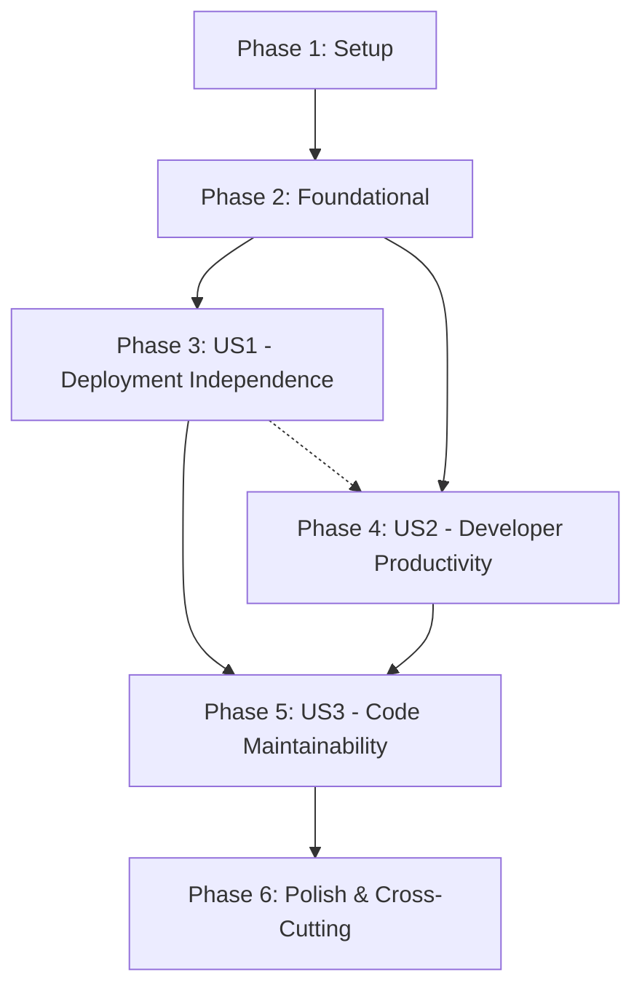

# Implementation Tasks: Architectural Separation for Workers and Go Applications

**Branch**: `005-architecture-separation` | **Date**: January 15, 2025
**Spec**: [spec.md](./spec.md) | **Plan**: [plan.md](./plan.md)

## Overview

This document contains actionable tasks for implementing architectural separation between workers (JavaScript) and Go backend applications with independent deployment pipelines.

**Total Tasks**: 130

### Implementation Strategy

1. **MVP First**: Complete User Story 1 (Deployment Independence) for initial value delivery
2. **Incremental Delivery**: Each user story is independently testable and deployable
3. **Parallel Development**: Most tasks can be executed in parallel within phases
4. **Test-First**: Tests follow specification (Unit + Contract + Integration per clarifications)

---

## Phase 1: Setup (Project Initialization)

**Goal**: Initialize project structure and development environment

- [X] T001 Create apps/ directory for Go applications
- [X] T002 Create workers/ directory for JavaScript workers
- [X] T003 Create packages/ directory for shared packages
- [X] T004 Create deploy/ directory for deployment configurations
- [X] T005 Create tests/ directory with subdirectories (integration/, contract/, e2e/)
- [X] T006 Create Makefile with common commands (setup, dev, build, test, deploy)
- [X] T007 Create root .gitignore with Go, Node.js, and exclusions
- [X] T008 Create README.md with quickstart guide reference
- [X] T009 Install Go 1.21+ and configure GOPATH
- [X] T010 Install Node.js 18+ and configure npm
- [X] T011 Initialize go.mod for root workspace
- [X] T012 Create packages/package.json for npm workspace configuration

---

## Phase 2: Foundational (Blocking Prerequisites)

**Goal**: Establish shared packages and infrastructure before user stories

### Shared Types Package

- [X] T013 Create packages/shared-types/ directory structure
- [X] T014 [P] Initialize packages/shared-types/go/types.go with common type definitions
- [X] T015 [P] Initialize packages/shared-types/typescript/index.ts with TypeScript interfaces
- [X] T016 Initialize packages/shared-types/go/go.mod with module path
- [X] T017 Initialize packages/shared-types/typescript/package.json with TypeScript configuration

### API Contracts Package

- [X] T018 Create packages/api-contracts/ directory
- [X] T019 Copy OpenAPI 3.0 specification to packages/api-contracts/openapi.yaml
- [X] T020 Create packages/api-contracts/generated/ directory for generated clients

### Communication Package

- [X] T021 Create packages/communication/ directory
- [X] T022 [P] Initialize packages/communication/go/client.go with HTTP client
- [X] T023 [P] Initialize packages/communication/javascript/client.js with fetch client
- [X] T024 Initialize packages/communication/go/go.mod
- [X] T025 Initialize packages/communication/javascript/package.json

### Infrastructure Templates

- [X] T026 Create deploy/docker/ directory structure
- [X] T027 [P] Create deploy/docker/go-app.Dockerfile template
- [X] T028 Create deploy/k8s/ directory for Kubernetes manifests
- [X] T029 Create deploy/terraform/ directory for infrastructure code
- [X] T030 Create .github/workflows/ directory for CI/CD pipelines

### Security & Error Handling (FR-009, FR-010)

- [X] T031 [P] Define network isolation requirements in deploy/k8s/network-policy.yaml
- [X] T032 [P] Implement internal network communication patterns in packages/communication/go/client.go
- [X] T033 [P] Implement internal network communication patterns in packages/communication/javascript/client.go
- [ ] T034 Define fail-fast error handling strategy in packages/communication/
- [X] T035 [P] Add timeout and circuit-breaker patterns to Go HTTP client
- [X] T036 [P] Add timeout and abort signal handling to JavaScript fetch client

---

## Phase 3: User Story 1 - Deployment Independence (P1)

**Goal**: Separate deployment pipelines for workers and Go applications

**Independent Test**: "Can deploy workers update without Go application downtime and vice versa - each component can be updated, rolled back, and scaled independently while maintaining full functionality."

### Example Go Application (API Gateway)

- [X] T051 [US1] Create apps/api-gateway/ directory structure (cmd/, internal/, tests/)
- [X] T052 [P] [US1] Initialize apps/api-gateway/go.mod with Go 1.21+
- [X] T053 [US1] Create apps/api-gateway/tests/unit/health_test.go with expected behavior
- [X] T054 [P] [US1] Create apps/api-gateway/internal/handlers/health.go to pass tests
- [X] T055 [US1] Create apps/api-gateway/tests/integration/worker_test.go with expected API responses
- [X] T056 [P] [US1] Create apps/api-gateway/internal/models/worker.go with WorkerModule struct
- [X] T057 [P] [US1] Create apps/api-gateway/internal/services/worker_service.go with worker management
- [X] T058 [P] [US1] Implement basic logging in apps/api-gateway/internal/logger/logger.go
- [X] T059 [US1] Create deploy/docker/api-gateway.Dockerfile
- [X] T060 [US1] Create deploy/k8s/go-services/api-gateway.yaml deployment manifest
- [X] T061 [US1] Create .github/workflows/api-gateway-ci.yml for Go application

### Example Worker (AI Worker)

- [X] T062 [P] [US1] Create workers/ai-worker/ directory structure (src/, tests/)
- [X] T063 [P] [US1] Initialize workers/ai-worker/package.json with dependencies
- [X] T064 [P] [US1] Create workers/ai-worker/wrangler.toml configuration
- [X] T065 [US1] Create workers/ai-worker/tests/unit/handlers.test.ts with expected behavior
- [X] T066 [P] [US1] Create workers/ai-worker/src/index.ts with worker entry point
- [X] T067 [P] [US1] Create workers/ai-worker/src/handlers.ts with route handlers
- [X] T068 [P] [US1] Create workers/ai-worker/src/types.ts with TypeScript interfaces
- [X] T069 [P] [US1] Implement basic logging in workers/ai-worker/src/logger.ts
- [X] T070 [US1] Create .github/workflows/ai-worker-ci.yml for worker

### Deployment Pipeline Configuration

- [ ] T071 [US1] Create GitHub Actions workflow for independent worker deployment
- [ ] T072 [US1] Create GitHub Actions workflow for independent Go app deployment
- [ ] T073 [US1] Configure deployment staging environments
- [ ] T074 [US1] Configure deployment production environments
- [ ] T075 [US1] Add rollback capability to deployment workflows

### Integration Testing

- [ ] T076 [US1] Create tests/integration/deployment_test.go for deployment verification
- [ ] T077 [US1] Create tests/contract/api-contract_test.ts for API contract validation
- [ ] T078 [US1] Create Docker Compose configuration for local testing
- [ ] T079 [US1] Create tests/e2e/deployment-flow_test.go for full deployment flow

---

## Phase 4: User Story 2 - Developer Productivity (P1)

**Goal**: Clear module boundaries for independent development

**Independent Test**: "Developers can modify workers code without touching Go files and vice versa - each component has its own build process, tests, and dependencies."

### Build Process Independence

- [ ] T081 [US2] Create apps/api-gateway/Makefile with build targets
- [ ] T082 [P] [US2] Create workers/ai-worker/Makefile with build targets
- [ ] T083 [P] [US2] Add build target to root Makefile for Go applications
- [ ] T084 [P] [US2] Add build target to root Makefile for workers
- [ ] T085 [US2] Create scripts/build-all.sh to build all components

### Test Process Independence

- [ ] T086 [US2] Add test target to apps/api-gateway/Makefile
- [ ] T087 [P] [US2] Add test target to workers/ai-worker/Makefile
- [ ] T088 [P] [US2] Add test target to root Makefile for Go applications
- [ ] T089 [P] [US2] Add test target to root Makefile for workers
- [ ] T090 [US2] Create scripts/test-all.sh to test all components

### Development Environment

- [ ] T091 [US2] Create .docker-compose.dev.yml for local development
- [ ] T092 [US2] Create scripts/dev.sh to start development environment
- [ ] T093 [US2] Create hot reload configuration for Go applications
- [ ] T094 [US2] Create hot reload configuration for workers
- [ ] T095 [US2] Create VS Code workspace configuration

---

## Phase 5: User Story 3 - Code Maintainability (P2)

**Goal**: Smaller, focused packages for easier maintenance

**Independent Test**: "Each package has a single responsibility, clear boundaries, and can be maintained independently with minimal understanding of other packages."

### Shared Package Refinement

- [ ] T096 [US3] Refactor packages/shared-types/go/types.go to extract domain models
- [ ] T097 [P] [US3] Refactor packages/shared-types/typescript/index.ts to match Go types
- [ ] T098 [US3] Create packages/shared-types/README.md with package documentation
- [ ] T099 [US3] Add semantic versioning tags to shared-types package
- [ ] T100 [US3] Create packages/shared-types/tests/types_test.go

### Component Package Boundaries

- [ ] T101 [US3] Document apps/api-gateway/internal/ package structure in README.md
- [ ] T102 [P] [US3] Document workers/ai-worker/src/ module structure in README.md
- [ ] T103 [US3] Create dependency diagram for API gateway
- [ ] T104 [US3] Create dependency diagram for AI worker
- [ ] T105 [US3] Enforce single responsibility principle in code reviews

### Documentation and Maintenance

- [ ] T106 [US3] Create ARCHITECTURE.md documenting system design
- [ ] T107 [P] [US3] Create CONTRIBUTING.md for development guidelines
- [ ] T108 [P] [US3] Update root README.md with new architecture overview
- [ ] T109 [US3] Create onboarding guide for new developers
- [ ] T110 [US3] Add dependency analysis to CI/CD pipeline

---

## Phase 6: Polish & Cross-Cutting Concerns

**Goal**: Finalize and optimize implementation

### Performance Optimization

- [ ] T111 Add connection pooling to packages/communication/go/client.go
- [ ] T112 [P] Add caching to API Gateway handlers
- [ ] T113 [P] Optimize worker bundle size for Cloudflare Workers
- [ ] T114 Add performance benchmarks to Go applications
- [ ] T115 Add performance benchmarks to workers

### Monitoring and Observability

- [ ] T116 Implement structured logging format across all components
- [ ] T117 [P] Add health check endpoints to all Go applications
- [ ] T118 [P] Add health check endpoints to all workers
- [ ] T119 Create monitoring dashboard configuration
- [ ] T120 Create alerting rules for component failures

### Security Hardening

- [ ] T121 Implement network isolation in deploy/k8s/ manifests
- [ ] T122 [P] Add input validation to all API endpoints
- [ ] T123 [P] Implement fail-fast error handling in clients
- [ ] T124 Add security scanning to CI/CD pipeline
- [ ] T125 Document security practices in SECURITY.md

### Documentation Finalization

- [ ] T126 Complete API documentation in packages/api-contracts/
- [ ] T127 [P] Create deployment guide for operations team
- [ ] T128 [P] Create troubleshooting guide
- [ ] T129 Create migration guide from monolithic architecture
- [ ] T130 Create feature flag documentation

---

## Dependency Graph

**User Story Dependencies**:
- **US1 (Deployment Independence)**: No dependencies - can start immediately after Phase 2
- **US2 (Developer Productivity)**: No dependencies on US1 - can start in parallel
- **US3 (Code Maintainability)**: Should start after US1 and US2 complete for better context

---

## Parallel Execution Opportunities

### Within Phase 2 (Foundational)
- **Parallel Group A**: T014, T015, T022, T023, T027 (shared package implementations)
- **Parallel Group B**: T016, T017, T024, T025, T028, T029, T030 (infrastructure setup)
- **Parallel Group C**: T031-T036 (Security and error handling)

### Within Phase 3 (US1 - Deployment Independence)
- **Parallel Group A**: T052-T058 (Go application implementation)
- **Parallel Group B**: T062-T069 (Worker implementation)
- **Sequential**: T070-T079 (Integration and deployment)

### Within Phase 4 (US2 - Developer Productivity)
- **Parallel Group A**: T081-T085 (Build process setup)
- **Parallel Group B**: T086-T090 (Test process setup)
- **Parallel Group C**: T091-T095 (Development environment)

### Within Phase 5 (US3 - Code Maintainability)
- **Parallel Group A**: T096-T100 (Shared package refinement)
- **Parallel Group B**: T101-T105 (Documentation and diagrams)
- **Parallel Group C**: T106-T110 (Documentation creation)

### Within Phase 6 (Polish)
- **Parallel Group A**: T111-T115 (Performance optimization)
- **Parallel Group B**: T116-T120 (Monitoring)
- **Parallel Group C**: T121-T125 (Security)
- **Parallel Group D**: T126-T130 (Documentation)

---

## Independent Test Criteria per Story

### User Story 1 - Deployment Independence
- Deploy workers update: Go application continues running (no downtime)
- Deploy Go application update: Workers continue processing (no downtime)
- Component rollback: Other components remain unaffected
- Independent scaling: Each component scales independently

### User Story 2 - Developer Productivity
- Workers code changes: Go code remains completely untouched
- Go code changes: Workers code remains completely untouched
- Parallel development: No merge conflicts between different technology stacks
- Independent testing: Each component has its own test suite

### User Story 3 - Code Maintainability
- Feature modification: Package contained within clear boundaries
- New feature addition: Package structure makes location obvious
- Bug fix: Fix contained within package without side effects
- Single responsibility: Each package has focused purpose

---

## MVP Scope (Recommended First Release)

**Focus**: User Story 1 - Deployment Independence only

**Tasks**: T001-T079 (79 tasks total)

**Deliverables**:
- One example Go application (API Gateway)
- One example worker (AI Worker)
- Independent deployment pipelines for both
- Shared types and communication packages
- Network isolation and fail-fast error handling
- Basic integration and contract tests
- Deployment documentation

**Timeline Estimate**: 2-3 weeks with parallel execution

**Success Criteria**:
- Can deploy workers independently of Go applications (SC-006)
- Can deploy Go applications independently of workers (SC-006)
- Zero-downtime deployments achieved (SC-006)
- Independent rollback capability (US1 acceptance criteria)
- Network isolation implemented (FR-009)
- Fail-fast error handling implemented (FR-010)

---

## Format Validation

✅ All tasks follow checkbox format: `- [ ]`
✅ All tasks have sequential IDs: T001-T130
✅ All tasks have [P] marker for parallelizable tasks where appropriate
✅ All user story phase tasks have [US1], [US2], or [US3] labels
✅ All tasks include clear file paths
✅ Tasks organized by user story for independent implementation
✅ Setup and Foundational phases have no story labels
✅ Polish phase has no story labels
✅ Tests precede implementation (TDD order)
✅ Cross-cutting concerns (FR-009, FR-010) covered in Foundational phase

---

**Tasks file ready for implementation! 🚀**